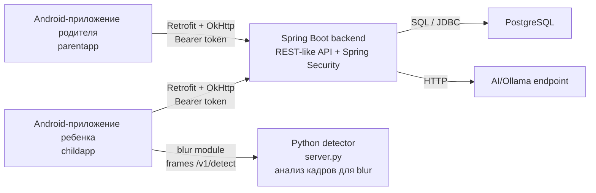

# SisterControl

SisterControl система родительского контроля. В проекте есть Android-приложение родителя, Android-приложение ребенка, backend на Java/Spring Boot, база PostgreSQL, сервис для детекции и размытия нежелательного контента, AI-поддержка ребенка.

## Мотивация проекта

Мотивацией создания приложения стала необходимость выстроить безопасную и доверительную цифровую среду для ребенка. Современные дети рано начинают пользоваться интернетом, но не всегда могут самостоятельно распознать опасный контент, кибербуллинг или чрезмерную нагрузку от гаджетов.
Приложение помогает родителям быть рядом с детьми не через тотальный контроль, а через заботу, поддержку и прозрачные инструменты взаимодействия. Оно объединяет безопасность, умеренное ограничение экранного времени и возможность диалога, формируя баланс между свободой ребенка и ответственностью взрослого.

Главная идея проекта --- не запрет, а Care: создать цифровую защитную среду, в которой ребенок чувствует поддержку, а родитель --- спокойствие.


## Стек

| Область | Технологии |
| --- | --- |
| Backend | Java 21, Spring Boot, Spring Web, Spring Security, JDBC|
| База данных | PostgreSQL |
| Android | Java, Retrofit, OkHttp |
| Карта и геолокация | osmdroid, Android LocationManager |
| Детектор контента | Python, FastAPI, NudeNet-related detector flow |

## Модули проекта

| Модуль | За что отвечает |
| --- | --- |
| `backend` | Spring Boot API: регистрация, авторизация, привязка родителя и ребенка, команды, GPS, экранное время, сообщения |
| `parentapp` | Android-приложение родителя: вход, привязка ребенка, карта GPS, экранное время, события, сообщения |
| `childapp` | Android-приложение ребенка: вход, код привязки, главный экран, получение команд, GPS-разрешения |
| `childassistant` | UI ИИ-ассистента ребенка |
| `timeguard` | Модуль контроля экранного времени через Accessibility Service |
| `blocker` | Модуль блокировки сайтов/приложений через Accessibility Service |
| `blur` | Модуль размытия нежелательного контента |
| `server.py` | Python-сервис детекции контента|

## Архитектура



## Backend

```text
controller  -> HTTP-ручки
service     -> бизнес-логика
repository  -> SQL-запросы через JdbcTemplate
security    -> проверка Bearer-токена и настройка Spring Security
dto         -> request/response модели
config      -> настройки приложения
exception   -> обработка ошибок API
```

## Тестирование
.mp4)

