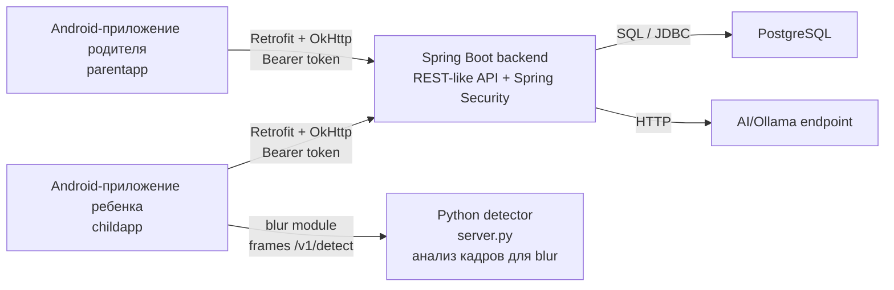
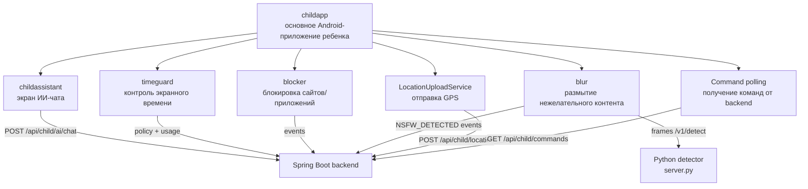
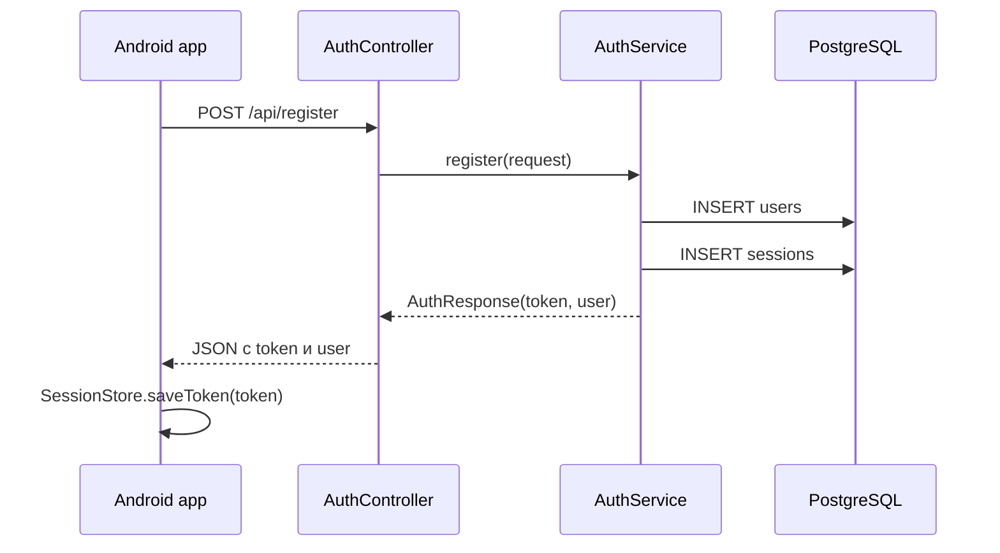
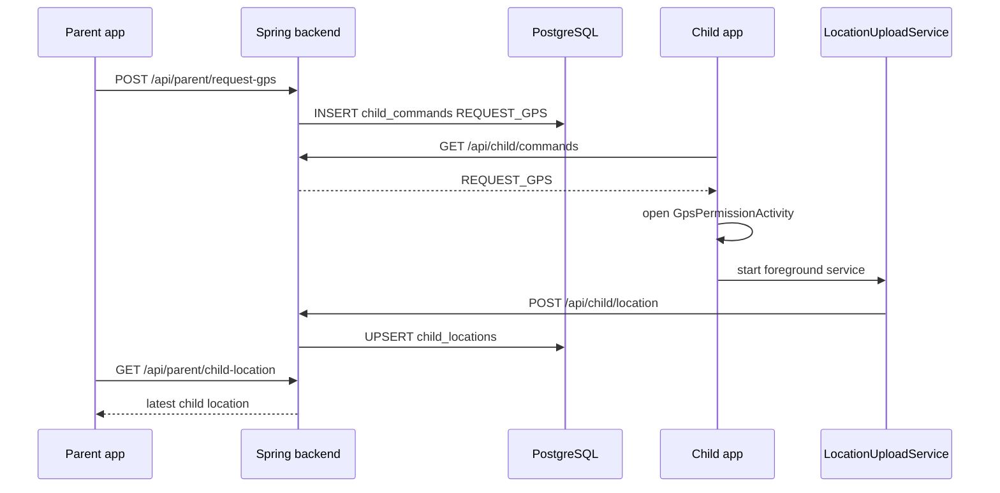
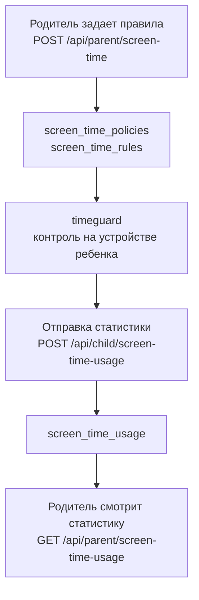

# SisterControl

SisterControl - учебный pet-проект системы родительского контроля. В проекте есть Android-приложение родителя, Android-приложение ребенка, backend на Java/Spring Boot, база PostgreSQL и отдельный Python-сервис для детекции нежелательного контента.

Проект не стоит воспринимать как готовую промышленную систему родительского контроля. Его смысл - показать полный клиент-серверный сценарий: регистрацию, авторизацию, роли родителя и ребенка, привязку устройств, команды от родителя к ребенку, отправку GPS, настройки экранного времени, Android-сервисы и запуск backend-инфраструктуры через Docker.

## Стек

| Область | Технологии |
| --- | --- |
| Backend | Java 21, Spring Boot, Spring Web, Spring Security, JDBC, Flyway |
| База данных | PostgreSQL |
| Android | Java, Android SDK, AppCompat, Retrofit, OkHttp |
| Android-сервисы | Foreground Service, Accessibility Service, BroadcastReceiver, SharedPreferences |
| Карта и геолокация | osmdroid, Android LocationManager |
| Детектор контента | Python, FastAPI, NudeNet-related detector flow |
| Контейнеризация | Docker, Docker Compose |

## Модули проекта

| Модуль | За что отвечает |
| --- | --- |
| `backend` | Spring Boot API: регистрация, авторизация, привязка родителя и ребенка, команды, GPS, экранное время, сообщения |
| `parentapp` | Android-приложение родителя: вход, привязка ребенка, карта GPS, экранное время, события, сообщения |
| `childapp` | Android-приложение ребенка: вход, код привязки, главный экран, получение команд, GPS-разрешения |
| `childassistant` | UI ИИ-ассистента ребенка. Технически это отдельный Gradle-модуль, но функционально он открывается из `childapp` |
| `timeguard` | Модуль контроля экранного времени через Accessibility Service |
| `blocker` | Модуль блокировки сайтов/приложений через Accessibility Service |
| `blur` | Модуль размытия нежелательного контента |
| `server.py` | Python-сервис детекции, оставлен отдельно от Java/Spring backend |

Важно: `childassistant`, `timeguard`, `blocker` и `blur` подключены к `childapp` как Android-модули. На уровне пользователя это части детского приложения, а не отдельные самостоятельные приложения.

## Архитектура

На верхнем уровне система выглядит так:



`server.py` - это не отдельный пользовательский клиент. Это вспомогательный Python-сервис: модуль `blur` отправляет туда кадры экрана, а сервис возвращает результат детекции нежелательного контента. Сам факт обнаружения затем логируется в backend как событие `NSFW_DETECTED`.

Детское приложение внутри устроено подробнее:



Такое разделение важно: `childassistant` выделен в отдельный Gradle-модуль для организации кода, но запускается из `childapp` через `AssistantChatActivity`. Поэтому на пользовательском уровне ИИ-ассистент является частью приложения ребенка.

## Backend

Backend сделан как обычное слоистое Spring Boot-приложение:

```text
controller  -> HTTP-ручки
service     -> бизнес-логика
repository  -> SQL-запросы через JdbcTemplate
security    -> проверка Bearer-токена и настройка Spring Security
dto         -> request/response модели
config      -> настройки приложения, CORS, HTTP-клиенты
exception   -> обработка ошибок API
```

Типичный путь запроса:

```text
Android Activity
  -> ApiService, созданный Retrofit
  -> HTTP-запрос через OkHttp
  -> Spring Security filter
  -> Spring Controller
  -> Service
  -> Repository
  -> PostgreSQL
```

`ApiService` в Android - это не серверная реализация. Это интерфейс клиента. Retrofit на его основе создает объект, который умеет отправлять HTTP-запросы. На backend эти запросы принимают Spring-контроллеры.

## Авторизация

В проекте используются opaque bearer tokens, а не JWT.

Сценарий регистрации или входа:

1. Пользователь отправляет email, пароль и роль на `/api/register` или `/api/login`.
2. Backend проверяет данные.
3. При регистрации backend сохраняет пользователя в таблицу `users`.
4. Пароль хранится не открытым текстом, а как BCrypt-хэш.
5. Backend создает случайный UUID-токен.
6. Токен сохраняется в таблицу `sessions` вместе с `user_id` и временем истечения.
7. Android сохраняет токен локально в `SessionStore`, то есть в `SharedPreferences`.
8. Во все защищенные запросы клиент добавляет заголовок:

```http
Authorization: Bearer <token>
```

Spring Security по этому токену находит сессию и пользователя в базе. После этого контроллеры и сервисы понимают, кто сделал запрос и какая у него роль: `PARENT` или `CHILD`.



Такая схема не является JWT-авторизацией. Это серверные сессии с Bearer-токеном. Для учебного проекта это нормальная и понятная схема, но для production ее нужно усиливать: HTTPS, logout, refresh flow или продуманное продление сессий, хранение хэша токена вместо токена в чистом виде, ограничение частоты запросов, отключение подробного HTTP-логирования в release.

## Привязка родителя и ребенка

Привязка работает через код:

1. Ребенок входит в приложение.
2. Детское приложение создает короткий pairing code.
3. Родитель вводит этот код в `parentapp`.
4. Backend проверяет код.
5. Backend создает запись в таблице `connections`.

После привязки родительские запросы обычно не передают произвольный `childId`. Backend сам находит ребенка по текущему родителю через таблицу `connections`. Это снижает риск ситуации, когда клиент вручную подставит чужой id.

## Запрос GPS

Родитель не подключается к телефону ребенка напрямую. Он создает команду на backend, а детское приложение периодически забирает команды.



Идея простая: родитель просит координаты, backend кладет команду, ребенок забирает команду, включает отправку координат, родитель читает последнюю известную точку.

## Экранное время

Экранное время разделено на три части:

1. Родитель задает политику: общий дневной лимит и лимиты по приложениям.
2. Детский модуль `timeguard` получает политику и следит за использованием приложений.
3. Ребенок отправляет статистику на backend, а родитель потом ее смотрит.



## Основные группы API

| Группа | Примеры ручек | Кто использует |
| --- | --- | --- |
| Auth | `POST /api/register`, `POST /api/login`, `DELETE /api/me` | родитель и ребенок |
| Parent | `/api/parent/pair`, `/api/parent/events`, `/api/parent/request-gps` | только `PARENT` |
| Child | `/api/child/create-code`, `/api/child/commands`, `/api/child/location` | только `CHILD` |
| Screen time | `/api/parent/screen-time`, `/api/child/screen-time-usage` | родитель и ребенок |
| Messages | `/api/child/trust-letter`, `/api/parent/message-to-child` | родитель и ребенок |
| AI | `/api/child/ai/chat` | ребенок |
| Health | `/api/health` | без авторизации |

## Конфигурация IP-адреса

Настройки локальной сети вынесены в один файл:

```text
config/server.properties
```

Пример:

```properties
server.host=10.46.218.180
server.port=3000
detector.port=8080
ollama.port=11434
```

Android-модули читают этот файл при сборке Gradle и генерируют значения в `BuildConfig`. Если IP-адрес компьютера в локальной сети поменялся, достаточно изменить `server.host` в одном месте.

## База данных

Схема базы создается через Flyway:

```text
backend/src/main/resources/db/migration/V1__init.sql
```

Основные таблицы:

| Таблица | Назначение |
| --- | --- |
| `users` | пользователи, email, хэш пароля, роль |
| `sessions` | серверные сессии и Bearer-токены |
| `pairing_codes` | коды привязки ребенка к родителю |
| `connections` | связь родителя и ребенка |
| `child_commands` | команды для детского устройства |
| `child_locations` | последняя GPS-точка ребенка |
| `child_events` | события, которые видит родитель |
| `screen_time_policies` | общая политика экранного времени |
| `screen_time_rules` | лимиты по конкретным приложениям |
| `screen_time_usage` | статистика использования приложений |
| `trust_letters` | письма доверия от ребенка родителю |
| `parent_messages` | сообщения от родителя ребенку |

## Сборка

Полная сборка на Windows:

```powershell
.\gradlew.bat build
```

Только backend:

```powershell
.\gradlew.bat :backend:bootJar
```

Только приложение родителя:

```powershell
.\gradlew.bat :parentapp:assembleDebug
```

Только приложение ребенка:

```powershell
.\gradlew.bat :childapp:assembleDebug
```

## Docker

Запуск backend, detector и PostgreSQL:

```bash
docker compose up --build
```

В `docker-compose.yml` PostgreSQL запускается отдельным сервисом. Это практичнее, чем складывать приложение и базу данных в один контейнер.

Порты по умолчанию:

| Порт | Сервис |
| --- | --- |
| `3000` | Spring Boot backend |
| `8080` | Python detector |
| `5432` | PostgreSQL внутри docker compose network |

## Ограничения текущей версии

- Это pet-проект, а не production-ready система родительского контроля.
- Авторизация использует серверные opaque-токены, refresh-token flow пока нет.
- Токены сейчас хранятся в таблице `sessions`; для production лучше хранить не сам токен, а его хэш.
- Android-клиенты в нескольких местах создают Retrofit-клиент напрямую через `ApiService.create()`. Архитектурно лучше вынести общий `ApiClient`.
- Некоторые функции требуют ручных Android-разрешений: Accessibility, overlay, location.
- Python detector остается отдельным сервисом.
- Команды и GPS обновляются через polling, а не через push-уведомления или WebSocket.

## Что показывает проект

- Перевод смешанного Kotlin/Node.js проекта в Java/Spring Boot архитектуру.
- Разделение backend-кода на `controller`, `service`, `repository`, `security`, `config`, `dto`.
- REST-like API с ролями родителя и ребенка.
- Авторизацию через Spring Security и Bearer-токены.
- Работу Android-клиентов с backend через Retrofit и OkHttp.
- Хранение пользователей, сессий, связей, команд, GPS и экранного времени в PostgreSQL.
- Использование Android background/service-механизмов для задач родительского контроля.
- Запуск backend-инфраструктуры через Docker Compose.
